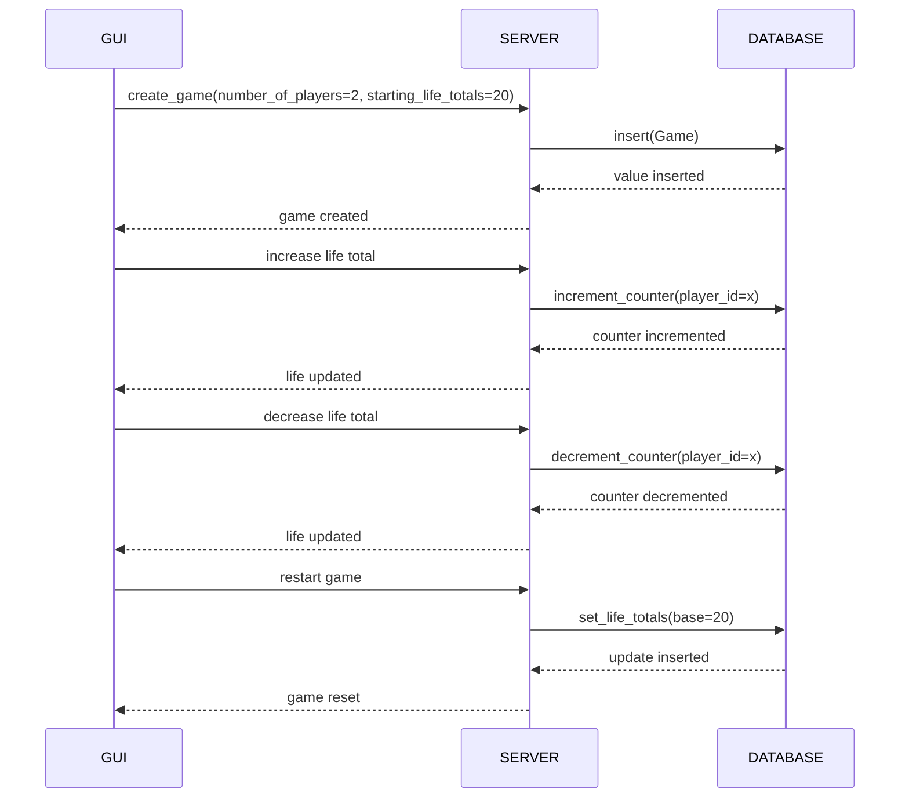

# obs-life-tracker

# Task Tracker
[Trello](https://trello.com/b/ciuEOQ4o/obs-life-tracker)

# Description
An open-source obs-plugin to update on-screen life totals for card games. The intent is to provide an end-to-end solution to be able to display life totals from an in-person card game (i.e. Magic The Gathering) and easily integrate that display on a streaming service life OBS. This service consists of three components:
- GUI
- REST API
- OBS INTEGRATION
- DATABASE

### GUI
The GUI (graphic user interface) is a website hosted on the REST API server. In its simplest form, it is an HTML page with two displays: 1 life total for player 1 and 1 life total for player 2. Included in this GUI is a method to reset the life totals.

### REST API
The REST API is the main point of interaction with the GUI allowing players to update a shared state between the server/streamer setup and the players. This will be a wrapper between the database and the player's GUI. Updates to the GUI trigger calls to the REST API. Which in turn updates the DATABASE.

### DATABASE
The DATABASE is the method of storage of the shared state between the server and GUI. On updates to this state, scripts are fired to update the display on obs to update a source to the indicated value.

### OBS Integration
On a state update for the database, a script is fired to update a source in OBS that then causes the display to update to according life total for the user. 

# Integration

